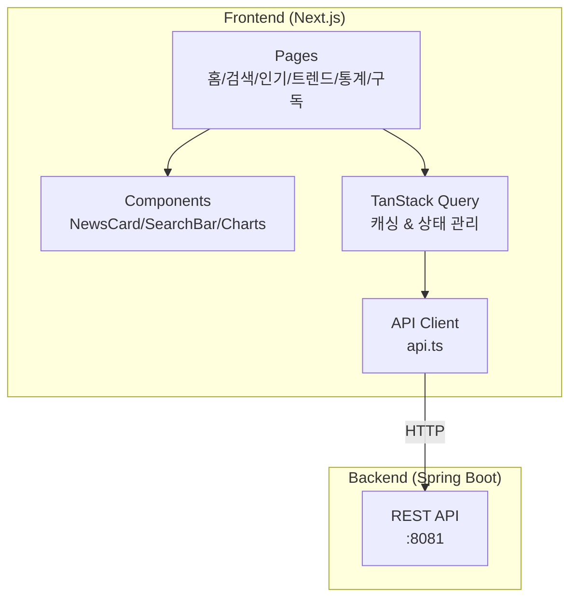

# TrendStream Frontend


> AI 기반 IT 뉴스 분석 플랫폼의 프론트엔드

## 소개

TrendStream Frontend는 [TrendStream Backend](https://github.com/your-github/TrendStream)에서 수집하고 AI로 분석한 IT 뉴스를 시각화하는 웹 애플리케이션입니다.

## 기술 선택 이유

### Next.js - 프레임워크
| 요구사항 | Next.js 선택 이유 |
|----------|-------------------|
| SEO 최적화 | SSR/ISR 지원으로 검색 엔진 크롤링 용이 |
| 빠른 페이지 로드 | App Router + React Server Components |
| 개발 생산성 | 파일 기반 라우팅, API Routes 내장 |

### TanStack Query - 상태 관리
| 요구사항 | 선택 이유 |
|----------|-----------|
| 서버 상태 관리 | 캐싱, 백그라운드 리패치 자동화 |
| 로딩/에러 처리 | `isLoading`, `isError` 상태 내장 |
| 무한 스크롤 | `useInfiniteQuery` 지원 |

### Tailwind CSS - 스타일링
| 요구사항 | 선택 이유 |
|----------|-----------|
| 빠른 UI 개발 | 유틸리티 클래스로 인라인 스타일링 |
| 일관된 디자인 | 디자인 토큰 기반 시스템 |
| 번들 최적화 | 사용하지 않는 스타일 자동 제거 |

## 주요 기능

### 뉴스 조회
- 최신 뉴스 목록 (페이지네이션)
- AI 중요도 점수 기반 인기 뉴스
- 키워드 검색 (제목 + 설명 + AI 요약)
- 카테고리/소스별 필터링

### AI 분석 결과 표시
- 3줄 요약
- 감정 분석 (긍정/부정/중립)
- 중요도 점수 (0-100)
- 추출 키워드 태그

### 트렌드 분석
- 기간별 키워드 순위 (24시간/7일/30일)
- 키워드별 관련 뉴스 조회

### 통계 대시보드
- 오늘/이번 주 뉴스 수
- 소스별 뉴스 분포
- 시간대별/일별 수집 현황

### 키워드 구독
- 관심 키워드 구독
- 이메일 알림 설정
- 구독 관리

## 아키텍처



## 프로젝트 구조

```
trendstream-frontend/
├── app/
│   ├── page.tsx              # 홈 (최신 뉴스)
│   ├── layout.tsx            # 공통 레이아웃
│   ├── api.ts                # API 클라이언트
│   ├── types.ts              # TypeScript 타입
│   ├── providers.tsx         # TanStack Query Provider
│   ├── news/
│   │   ├── [id]/page.tsx     # 뉴스 상세
│   │   ├── search/page.tsx   # 검색 결과
│   │   ├── category/page.tsx # 카테고리별
│   │   └── source/page.tsx   # 소스별
│   ├── popular/page.tsx      # 인기 뉴스
│   ├── trends/page.tsx       # 트렌드 순위
│   ├── stats/page.tsx        # 통계 대시보드
│   └── subscriptions/page.tsx # 구독 관리
├── components/
│   ├── NewsCard.tsx          # 뉴스 카드
│   ├── NewsList.tsx          # 뉴스 그리드
│   ├── SearchBar.tsx         # 검색바
│   ├── Pagination.tsx        # 페이지네이션
│   ├── SentimentBadge.tsx    # 감정 배지
│   ├── ScoreBadge.tsx        # 점수 배지
│   └── TrendCard.tsx         # 트렌드 카드
└── .env.local                # 환경 변수
```

## 시작하기

### 요구사항
- Node.js 18+
- npm 또는 yarn
- [TrendStream Backend](https://github.com/your-github/TrendStream) 실행 중

### 설치

```bash
# 저장소 클론
git clone https://github.com/your-github/TrendStream-Front.git
cd TrendStream-Front/trendstream-frontend

# 의존성 설치
npm install

# 환경 변수 설정
cp .env.example .env.local
# NEXT_PUBLIC_API_URL=http://localhost:8081 설정
```

### 실행

```bash
# 개발 서버
npm run dev

# 빌드
npm run build

# 프로덕션 실행
npm start
```

브라우저에서 http://localhost:3000 접속

## 환경 변수

| 변수명 | 설명 | 예시 |
|--------|------|------|
| `NEXT_PUBLIC_API_URL` | 백엔드 API 주소 | `http://localhost:8081` |

## 페이지 목록

| 경로 | 설명 |
|------|------|
| `/` | 최신 뉴스 목록 |
| `/popular` | 인기 뉴스 (AI 점수순) |
| `/trends` | 트렌드 키워드 순위 |
| `/news/[id]` | 뉴스 상세 (AI 분석) |
| `/news/search` | 키워드 검색 |
| `/news/category` | 카테고리별 뉴스 |
| `/news/source` | 소스별 뉴스 |
| `/stats` | 통계 대시보드 |
| `/subscriptions` | 키워드 구독 관리 |

## 디자인 시스템

### 감정 분석 배지
| 상태 | 색상 |
|------|------|
| POSITIVE | 초록 (emerald) |
| NEGATIVE | 빨강 (red) |
| NEUTRAL | 회색 (slate) |

### 점수 배지
| 점수 | 스타일 |
|------|--------|
| 80+ | HOT 배지 (펄스 애니메이션) |
| 60-79 | 주황-노랑 그라데이션 |
| 40-59 | 노랑 배경 |
| 0-39 | 회색 배경 |

## 배포

### Vercel (권장)

1. GitHub 저장소 연결
2. Environment Variables 설정
3. 자동 배포

### 수동 배포

```bash
npm run build
npm start
```

## 관련 링크

- [TrendStream Backend](https://github.com/your-github/TrendStream)
- [Swagger API 문서](http://localhost:8081/swagger-ui.html)

## 라이선스

MIT License

## 기여자

- [@your-github](https://github.com/your-github)
